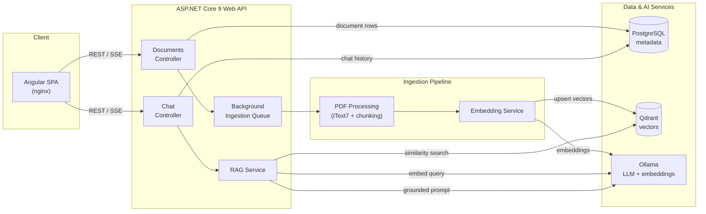

<h1> Kurumsal On-Prem RAG & Doküman Zekası Platformu</h1>

Tamamen kendi altyapınızda çalışan (self-hosted), üretim standartlarında bir Retrieval-Augmented Generation (RAG) platformudur. PDF dokümanlarınızı yükleyin, metinleri parçalara (chunk) ayırın, vektör veritabanında indeksleyin ve sayfa düzeyinde kaynak gösterimi (citation) ile dokümanlarınızla güvenli bir şekilde sohbet edin — hiçbir veriniz kurum dışına çıkmaz.

Tüm sistem tek bir "docker compose up" komutuyla ayağa kalkar.

--------------------------------------------------------------------------------

✨ Öne Çıkan Özellikler

- Varsayılan olarak On-Premise — Ollama ile yerel LLM ve embedding kullanımı; kod değişikliği gerektirmeden yalnızca konfigürasyon ile OpenAI uyumlu servis geçişi.
- Clean Architecture .NET 9 Backend — Domain, Application, Infrastructure ve API katmanları ile modüler ve sürdürülebilir mimari.
- Qdrant ile Semantik Arama — Cosine similarity tabanlı vektör araması ve metaveri filtreleme.
- Gerçek Zamanlı Yanıt Yayınlama (Streaming) — Server-Sent Events (SSE) protokolü üzerinden token tabanlı canlı yanıt akışı.
- Doğrulanmış Kaynak Gösterimi — Üretilen her yanıtta ilgili dosya adı, sayfa numarası ve benzerlik skoru ile kaynak parçacığı gösterimi.
- Asenkron İşleme Pipeline'ı — Doküman yüklemeleri anında 202 Accepted döner; metin çıkarma, embedding ve indeksleme arka plan servislerinde gerçekleşir.
- Modern Angular UI — Sürükle-bırak doküman yükleme, durum takibi ve sohbet arayüzü.

--------------------------------------------------------------------------------

🏗️ Mimari

[Client: Angular SPA (nginx)] -- REST / SSE --> [API: ASP.NET Core 9 Web API]
API Katmanı Bileşenleri: Documents Controller, Chat Controller, Background Ingestion Queue, RAG Service.

Pipeline (Ingestion):
PDF Processing (iText7 + chunking) -> Embedding Service -> Ollama (embeddings) / Qdrant (upsert vectors).

Sorgulama Akışı:
Chat Controller -> RAG Service -> Ollama (embed query) -> Qdrant (similarity search) -> Ollama (grounded prompt).

İstek Yaşam Döngüsü (Request Lifecycle):
1. Yükleme (Upload): POST /api/documents isteği PDF dosyasını kaydeder, veritabanında Pending durumunda bir kayıt oluşturur ve arka plan iş kuyruğuna ekler (anında 202 Accepted döner).
2. İşleme (Ingest): Arka plan servisi sayfa bazlı metin çıkarır (iText 7), metinleri örtüşen parçalara (chunk) böler, embedding oluşturur ve vektörleri Qdrant'a kaydeder. Durum Pending -> Processing -> Completed/Failed olarak güncellenir.
3. Sorgulama (Ask): POST /api/chat/stream soru metninin embedding'ini alır, en yakın K adet parçayı getirir, bağlam içeren prompt oluşturur ve yanıtı kaynak gösterimleriyle birlikte canlı olarak yayınlar.

--------------------------------------------------------------------------------

🧱 Teknoloji Yığını

- Arayüz (Frontend): Angular 19 (standalone bileşenler, signals), nginx
- Backend: .NET 9, ASP.NET Core Web API, Clean Architecture
- ORM / Metaveri: Entity Framework Core 9, PostgreSQL (Yerel geliştirme için SQLite)
- Vektör Veritabanı: Qdrant (HTTP REST API, cosine uzaklığı)
- LLM & Embedding: Ollama (llama3.2, nomic-embed-text) — OpenAI uyumlu
- PDF İşleme: iText 7
- API Dokümantasyonu: Swagger / OpenAPI (Swashbuckle)
- Orkestrasyon: Docker & Docker Compose

--------------------------------------------------------------------------------

🚀 Hızlı Başlangıç

Ön Gereksinimler:
- Docker ve Docker Compose v2
- Model ve imajlar için ~8 GB boş disk alanı (yalnızca ilk kurulumda)
- (Opsiyonel) Daha hızlı çıkarım (inference) için NVIDIA GPU + Container Toolkit

Çalıştırma:
git clone https://github.com/zeynepurtac/enterprise-rag-platform.git
cd enterprise-rag-platform
cp .env.example .env
docker compose up --build

İlk çalıştırmada ollama-init servisi sohbet ve embedding modellerini indirir (birkaç GB). Bu tek seferlik bir işlemdir; sonraki çalıştırmalar modeller volume üzerinde saklandığı için hızlı gerçekleşir. İlerleme durumunu takip etmek için: "docker compose logs -f ollama-init".

Servis Adresleri:
- Arayüz (UI): http://localhost:8081
- API Servisi: http://localhost:8080
- Swagger UI: http://localhost:8080/swagger
- Qdrant Paneli: http://localhost:6333/dashboard

--------------------------------------------------------------------------------

🔌 API Referansı

GET    /api/documents       : Tüm dokümanları listeler (en yeni ilk)
GET    /api/documents/{id}  : Tek bir dokümanı ve işlenme durumunu getirir
POST   /api/documents       : PDF yükler (multipart/form-data, file)
DELETE /api/documents/{id}  : Dokümanı ve ilişkili vektörleri siler
POST   /api/chat            : Soru sorar (tamamlanmış JSON yanıtı döner)
POST   /api/chat/stream     : Soru sorar (SSE canlı akış yanıtı döner)
GET    /health              : Servis sağlık kontrolü (Liveness probe)

Örnek İstek (cURL):
curl -X POST http://localhost:8080/api/chat \
  -H "Content-Type: application/json" \
  -d '{
        "question": "Sözleşmenin fesih şartları nelerdir?",
        "documentId": null,
        "history": []
      }'

--------------------------------------------------------------------------------

⚙️ Konfigürasyon

Ai__BaseUrl               : http://ollama:11434/v1 (OpenAI uyumlu LLM servis adresi)
Ai__ApiKey                : (boş) (Bearer anahtarı - OpenAI için gerekli)
Ai__ChatModel             : llama3.2 (Sohbet / üretim modeli)
Ai__EmbeddingModel        : nomic-embed-text (Embedding modeli)
Ai__EmbeddingDimensions   : 768 (Embedding model boyutuyla eşleşmelidir)
Qdrant__BaseUrl           : http://qdrant:6333 (Vektör veritabanı adresi)
Database__Provider        : postgres (postgres veya sqlite)
Rag__TopK                 : 5 (Soru başına getirilecek parça sayısı)
Rag__MinScore             : 0.25 (Parça kullanımı için minimum benzerlik skoru)
Chunking__MaxTokens       : 450 (Hedef parça boyutu - yaklaşık token)
Chunking__OverlapTokens   : 80 (Ardışık parçalar arasındaki örtüşme miktarı)

OpenAI Kullanımı İçin Ayarlar (backend servisinde):
Ai__BaseUrl: https://api.openai.com/v1
Ai__ApiKey: sk-...
Ai__ChatModel: gpt-4o-mini
Ai__EmbeddingModel: text-embedding-3-small
Ai__EmbeddingDimensions: 1536

--------------------------------------------------------------------------------

🧑‍💻 Yerel Geliştirme (Docker Olmadan)

Backend:
cd backend
dotnet run --project src/RagPlatform.Api

Frontend:
cd frontend
npm install
npm start

--------------------------------------------------------------------------------

📂 Proje Yapısı

enterprise-rag-platform/
├── docker-compose.yml         # Tüm sistem orkestrasyonu
├── .env.example               # Port, kimlik ve model konfigürasyonları
├── backend/                   # .NET 9 Clean Architecture çözümü
│   ├── Dockerfile
│   └── src/
│       ├── RagPlatform.Domain/          # Varlıklar (Entities), enum'lar
│       ├── RagPlatform.Application/     # Arayüzler (Interfaces), DTO'lar, modeller
│       ├── RagPlatform.Infrastructure/  # EF Core, Qdrant, Ollama, RAG, veri işleme
│       └── RagPlatform.Api/             # Controller'lar, Program.cs, Swagger
└── frontend/                  # Angular 19 SPA
    ├── Dockerfile
    ├── nginx.conf             # SPA yönlendirmesi + /api reverse proxy
    └── src/app/
        ├── core/              # Modeller ve servisler
        └── features/          # Doküman yönetimi paneli + Sohbet alanı

--------------------------------------------------------------------------------

🔍 Bu Platformda RAG Nasıl Çalışır?

1. Örtüşmeli Parçalama (Chunking with Overlap): İlgili cümlelerin bir arada kalmasını sağlar ve bağlam kaybını önleyerek arama kalitesini artırır.
2. Sayfa Bazlı İndeksleme: Her vektör hangi sayfadan çıkarıldığını bilir; böylece kaynak gösterimleri doğrudan PDF'teki doğru sayfaya işaret eder.
3. Eşik Skoru (Relevance Floor): Rag__MinScore ayarı ile zayıf eşleşmeler filtrelenir; yeterli bağlam bulunamadığında model uydurma yanıtlar (hallucination) vermek yerine bilgi bulunamadığını bildirir.
4. Sınırlandırılmış Sistem Prompt'u: Modele yalnızca sağlanan bağlamı kullanması ve kaynakları numara ile doğrulanabilir şekilde belirtmesi talimatı verilir.

--------------------------------------------------------------------------------

📝 Lisans
Bu proje MIT Lisansı (LICENSE) kapsamında lisanslanmıştır.

-----------------------------------------------------------------------------------
<h1> Enterprise On-Prem RAG & Document Intelligence Platform</h1>

A production-style, fully self-hosted **Retrieval-Augmented Generation (RAG)**
platform. Upload PDFs, have them chunked, embedded and indexed into a vector
database, then **chat with your documents** and get answers grounded in the
source text with **page-level citations** — all running on your own
infrastructure, with **no data leaving your network**.

The entire stack comes up with a single `docker compose up`.

---

## ✨ Highlights

- **On-prem by default** — local LLM + embeddings via [Ollama](https://ollama.com);
  swap to any OpenAI-compatible endpoint with config only, no code changes.
- **Clean Architecture .NET 9 backend** — Domain / Application / Infrastructure /
  API layering, dependency inversion, and clear separation of concerns.
- **Semantic search over Qdrant** — cosine similarity retrieval with metadata
  filtering, so answers can be scoped to a single document or the whole corpus.
- **Streaming answers** — token-by-token responses over Server-Sent Events.
- **Grounded citations** — every answer surfaces the exact source file, page and
  a snippet, with a relevance score.
- **Asynchronous ingestion** — uploads return instantly; extraction, embedding
  and indexing run on a background worker with live status in the UI.
- **Modern Angular UI** — drag-and-drop upload, document management and a chat
  workspace.

---

## 🏗️ Architecture



### Request lifecycle

1. **Upload** — `POST /api/documents` stores the PDF, creates a `Pending`
   record and enqueues a background job (returns `202 Accepted` immediately).
2. **Ingest** — the worker extracts text per page (iText 7), splits it into
   overlapping token-bounded chunks, embeds each chunk and upserts the vectors
   into Qdrant. Status transitions `Pending → Processing → Completed/Failed`.
3. **Ask** — `POST /api/chat/stream` embeds the question, retrieves the top-K
   most similar chunks (optionally filtered to one document), builds a grounded
   prompt and streams the model's answer back with citations.

---

## 🧱 Tech Stack

| Layer          | Technology                                                        |
| -------------- | ----------------------------------------------------------------- |
| Frontend       | Angular 19 (standalone components, signals), nginx                |
| Backend        | .NET 9, ASP.NET Core Web API, Clean Architecture                  |
| ORM / Metadata | Entity Framework Core 9, PostgreSQL (SQLite for local dev)        |
| Vector store   | Qdrant (HTTP REST API, cosine distance)                           |
| LLM & Embeds   | Ollama (`llama3.2`, `nomic-embed-text`) — OpenAI-compatible       |
| PDF extraction | iText 7                                                    |
| API docs       | Swagger / OpenAPI (Swashbuckle)                                   |
| Orchestration  | Docker & Docker Compose                                           |

---

## 🚀 Getting Started

### Prerequisites

- [Docker](https://docs.docker.com/get-docker/) and Docker Compose v2
- ~8 GB free disk space for the model + images (first run only)
- (Optional) an NVIDIA GPU + Container Toolkit for faster inference

### Run it

```bash
git clone <your-repo-url> enterprise-rag-platform
cd enterprise-rag-platform

# Optional: customise ports, credentials or models
cp .env.example .env

docker compose up --build
```

On the **first** start, the `ollama-init` service downloads the chat and
embedding models (a few GB). This is a one-time cost — subsequent starts are
fast because the models are cached in a named volume. You can watch progress
with `docker compose logs -f ollama-init`.

Once everything is healthy:

| Service        | URL                                            |
| -------------- | ---------------------------------------------- |
| **Web app**    | http://localhost:8081                          |
| **API**        | http://localhost:8080                          |
| **Swagger UI** | http://localhost:8080/swagger                  |
| **Qdrant**     | http://localhost:6333/dashboard                |

Upload a PDF, wait for its status to reach **Completed**, then start asking
questions.

---

## 🔌 API Reference

| Method   | Endpoint                 | Description                                   |
| -------- | ------------------------ | --------------------------------------------- |
| `GET`    | `/api/documents`         | List all documents (newest first)             |
| `GET`    | `/api/documents/{id}`    | Get a single document + processing status     |
| `POST`   | `/api/documents`         | Upload a PDF (`multipart/form-data`, `file`)  |
| `DELETE` | `/api/documents/{id}`    | Delete a document and its vectors             |
| `POST`   | `/api/chat`              | Ask a question (buffered JSON response)       |
| `POST`   | `/api/chat/stream`       | Ask a question (Server-Sent Events streaming) |
| `GET`    | `/health`                | Liveness probe                                |

### Example: ask a question

```bash
curl -X POST http://localhost:8080/api/chat \
  -H "Content-Type: application/json" \
  -d '{
        "question": "What is the termination clause?",
        "documentId": null,
        "history": []
      }'
```

---

## ⚙️ Configuration

All settings are overridable via environment variables using the standard
ASP.NET Core `__` (double-underscore) convention. The most useful ones:

| Variable                    | Default                    | Purpose                              |
| --------------------------- | -------------------------- | ------------------------------------ |
| `Ai__BaseUrl`               | `http://ollama:11434/v1`   | OpenAI-compatible LLM base URL       |
| `Ai__ApiKey`                | *(empty)*                  | Bearer key (required for OpenAI)     |
| `Ai__ChatModel`             | `llama3.2`                 | Chat / generation model              |
| `Ai__EmbeddingModel`        | `nomic-embed-text`         | Embedding model                      |
| `Ai__EmbeddingDimensions`   | `768`                      | Must match the embedding model       |
| `Qdrant__BaseUrl`           | `http://qdrant:6333`       | Vector database endpoint             |
| `Database__Provider`        | `postgres`                 | `postgres` or `sqlite`               |
| `Rag__TopK`                 | `5`                        | Chunks retrieved per question        |
| `Rag__MinScore`             | `0.25`                     | Minimum cosine score to use a chunk  |
| `Chunking__MaxTokens`       | `450`                      | Target chunk size (approx tokens)    |
| `Chunking__OverlapTokens`   | `80`                       | Overlap between consecutive chunks   |

### Using OpenAI instead of Ollama

Because the backend targets the OpenAI-compatible surface, switching providers
is purely configuration. Set on the `backend` service:

```yaml
Ai__BaseUrl: https://api.openai.com/v1
Ai__ApiKey: sk-...
Ai__ChatModel: gpt-4o-mini
Ai__EmbeddingModel: text-embedding-3-small
Ai__EmbeddingDimensions: 1536
```

---

## 🧑‍💻 Local Development (without Docker)

**Backend** (uses SQLite + your local Ollama automatically via the
`Development` profile):

```bash
cd backend
dotnet run --project src/RagPlatform.Api
# Swagger at http://localhost:8080/swagger
```

**Frontend**:

```bash
cd frontend
npm install
npm start
# App at http://localhost:4200 (proxies to the backend at :8080)
```

You'll need Ollama running locally (`ollama serve`) with the two models pulled
(`ollama pull llama3.2 && ollama pull nomic-embed-text`) and a Qdrant instance
(`docker run -p 6333:6333 qdrant/qdrant`).

---

## 📂 Project Structure

```
enterprise-rag-platform/
├── docker-compose.yml            # Full stack orchestration
├── .env.example                  # Configurable ports, creds, models
├── backend/                      # .NET 9 Clean Architecture solution
│   ├── Dockerfile
│   └── src/
│       ├── RagPlatform.Domain/           # Entities, enums (no dependencies)
│       ├── RagPlatform.Application/      # Interfaces, DTOs, models
│       ├── RagPlatform.Infrastructure/   # EF Core, Qdrant, Ollama, RAG, ingestion
│       └── RagPlatform.Api/              # Controllers, Program.cs, Swagger
└── frontend/                     # Angular 19 SPA
    ├── Dockerfile
    ├── nginx.conf                # SPA routing + /api reverse proxy (SSE-aware)
    └── src/app/
        ├── core/                 # Models & services (HTTP, streaming, state)
        └── features/             # Documents pane + Chat pane
```

---

## 🔍 How Retrieval-Augmented Generation Works Here

1. **Chunking with overlap** keeps related sentences together and preserves
   context across chunk boundaries, improving retrieval quality.
2. **Per-page chunking** means every vector remembers which page it came from,
   so citations point to a real location in the source PDF.
3. **A relevance floor** (`Rag__MinScore`) discards weak matches so the model
   isn't fed irrelevant context — if nothing clears the bar, the platform says
   so instead of hallucinating.
4. **A grounded system prompt** instructs the model to answer only from the
   provided context and to cite sources by number.

---

## 📝 License

Released under the [MIT License](LICENSE).
